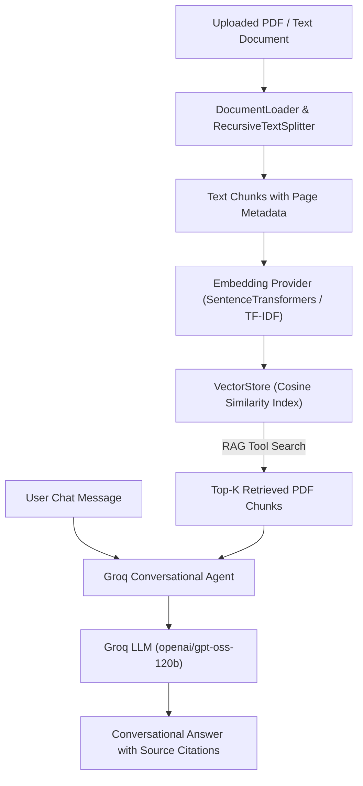

# CILI RAG System (Python 3.11 Compatible with Groq AI Chat & RAG Tool)

A lightweight, high-performance, modular **Conversational AI + Retrieval-Augmented Generation (RAG)** system built for PDF document indexing, vector similarity search, hybrid retrieval, and multi-turn chat grounded in document context.

Designed for maximum compatibility with **Python 3.11** and powered by **Groq AI** models (`openai/gpt-oss-120b`, `openai/gpt-oss-20b`, `qwen/qwen3.8-27b`).

---

## 🌟 Key Features

- **Groq Conversational AI Engine**: Multi-turn chat session with memory, powered by models like `openai/gpt-oss-120b`, `openai/gpt-oss-20b`, and `qwen/qwen3.8-27b`.
- **RAG Document Knowledge Tool**: Live vector search retrieves relevant context chunks from uploaded PDFs/documents and injects them directly into Groq AI's prompt context.
- **Dedicated PDF Web UI (`pdf_app.py`)**: Modern Streamlit web application featuring PDF drag & drop, document metrics, chat history, and source citation drawers.
- **Terminal Chat Session (`groq_chat.py`)**: Interactive terminal loop using Groq API + RAG tool.
- **Python 3.11+ Compatibility**: Clean modular architecture optimized for CPython 3.11+.
- **Multi-Format Document Parsing**: Native support for `.pdf`, `.txt`, `.md`, `.csv`, `.json`, `.docx` files with page tracking.
- **Hybrid Search Engine**: Combines dense Vector Cosine Similarity Search with sparse BM25-style keyword matching.
- **Zero-Dependency Fallbacks**: Includes pure Python TF-IDF embedding fallback and HTTP API fallbacks.
- **Automatic `.env` Key Manager**: Auto-loads `GROQ_API_KEY` and settings from project `.env` file.

---

## 🏗️ System Architecture



---

## 🛠️ Environment Setup

### Creating the `cili` Conda Environment

You can create and activate the `cili` conda environment with Python 3.11 using either the provided `environment.yml` or manual commands:

#### Option A: Using `environment.yml`
```bash
# Create environment from file
conda env create -f environment.yml

# Activate environment
conda activate cili
```

#### Option B: Manual Setup
```bash
# Create conda environment named cili with Python 3.11
conda create -n cili python=3.11 -y

# Activate environment
conda activate cili

# Install dependencies
pip install -r requirements.txt
```

---

## 🔑 Environment Variables & API Key Setup

Create or edit the `.env` file in the project root:

```env
# Groq API Key (Get your free key at https://console.groq.com/keys)
GROQ_API_KEY=gsk_your_groq_api_key_here

# Groq Model (openai/gpt-oss-120b | openai/gpt-oss-20b | qwen/qwen3.8-27b)
GROQ_MODEL=openai/gpt-oss-120b

# Default LLM Provider
LLM_PROVIDER=auto
```

---

## 🚀 Quick Start Guide

### 1. Launch PDF Question Answering Web UI

Upload your PDF document and chat conversationally:
```bash
streamlit run pdf_app.py
```

### 2. Interactive Terminal Chat Session

Run the terminal chat session with RAG tool:
```bash
python3 groq_chat.py
# or
python3 cli.py interactive
```

### 3. Launch Multi-Document Dashboard

Run the multi-file dashboard:
```bash
streamlit run app.py
```

### 4. Run Automated Unit Tests

Run the test suite to verify all modules:
```bash
python3 -m unittest discover tests/
```

### 5. CLI Query Commands

**Ingest documents from a directory:**
```bash
python3 cli.py ingest --path sample_data/
```

**Query the vector database:**
```bash
python3 cli.py query "What is Retrieval-Augmented Generation?"
```

---

## 📁 Repository Structure

```
cili/
├── pdf_app.py            # Dedicated PDF Conversational Streamlit Web UI
├── groq_chat.py          # Interactive Terminal Chat Session script with RAG Tool
├── app.py                # Multi-document Streamlit Web UI dashboard
├── config.py             # Configuration settings & auto .env loader
├── document_loader.py    # Document parsers with PDF page tracking & text chunker
├── embeddings.py         # Embedding providers (SentenceTransformers & TF-IDF)
├── vector_store.py       # Vector index with cosine similarity & hybrid search
├── rag_engine.py         # Conversational RAG Engine (Groq LLM + RAG Tool)
├── cli.py                # Command Line Tool interface
├── main.py               # Programmatic demonstration script
├── .env                  # Environment variables file (API Keys)
├── .env.example          # Environment variables template
├── .gitignore            # Git ignore configuration
├── requirements.txt      # Python dependencies list
├── environment.yml       # Conda environment definition for 'cili'
├── README.md             # Project documentation
├── sample_data/          # Sample document knowledge base
└── tests/                # Automated unit tests
```

---

## 🧪 Modules Overview

| Module | Description |
| :--- | :--- |
| `pdf_app.py` | Streamlit UI for PDF upload, conversational chat history, and live citation drawers. |
| `groq_chat.py` | Terminal interactive chat session using Groq LLM + RAG tool. |
| `config.py` | Holds chunking settings, storage paths, Groq API parameters, and auto `.env` loader. |
| `document_loader.py` | Reads `.pdf`, `.txt`, `.md`, `.csv`, `.json`, `.docx` files and memory streams into text chunks. |
| `embeddings.py` | Converts text chunks to dense vectors using `SentenceTransformers` or fallback `TFIDFEmbeddingProvider`. |
| `vector_store.py` | Stores vectors and metadata, offering `similarity_search()` and `hybrid_search()`. |
| `rag_engine.py` | Multi-turn conversational agent using Groq API + RAG retrieval tool. |
